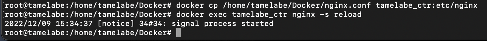

# Simple Docker

Введение в докер. Разработка простого докер образа для собственного сервера.

## Part 1. Готовый докер

## Часть 1. Готовый докер

Загрузка образа nginx через команду `docker pull`

Проверка наличия образа через команду `docker images`

Запуск образа через комнаду `docker run`

Проверка наличия процесса через команду `docker ps`

Просмотр информации о контейнере через команду \
`docker inspect [container_id]`

Размер докер образа

Его IP

Замапленый порт

Остановка докер образа и проверка его остановки

Запуск образа с замапленными портами

Проверка работы сервера

Остановка докер образа через команду `docker stop [container_id|container_name]` и проверка его остановки для выполнения 2 части задания

## Часть 2. Операции с контейнерами

Создание

Чтение конфигурационного файла nginx.conf внутри докер контейнера при помощи команды `exec`

Создание на локальной машине файла nginx.conf. Настройка в нем по пути /status отдачу страницы статуса сервера

* 30 строка закомментирована чтобы nginx не цеплял другие конфиг файлы, препятствующие корректрой работе раздела `/status`

Копирование созданного конфиг файла в докер образ командой `docker cp` и перезапуск nginx внутри докер образа через `exec`

Проверка статуса сервера

Экспорт докер контейнера в архив через команду `export`

Остановка контейнера, проверка остановки

Удаление образа через `docker rmi [image_id|repository]`

Удаление всех контейнеров

Импортировнаие контейнера через команду `import`

Запуск импортрованного контейнера

Проверка статуса сервера

## Часть 3. Мини веб-сервер

Загрузка и запуск образа nginx, запуск контейнера

Открытие контейнера через VSCode (перед запуском добавить в группу docker через `usermod -aG docker $USER`)

Установка gcc, spawn-dcgi, libfcgi-dev в контейнер

Создание сервера за языке С и FastCGI внутри контейнера

Компиляция и запуск сервера внутри контейнера

Создание nginx.conf

Копирование конфигурационного файла и перезапуск nginx

Открытие страницы

## Часть 4. Свой докер

Создание докерфайла, заполнение инструкциями, включающие:
- сборку исходников мини сервера на FastCgi из Pt.3
- запуск его на 8080 порту
- копирование внутрь образа написанный ./nginx/nginx.conf
- запуск nginx
  

Удаление всех образов и контейнеров

Сборка образа через команду `docker build` с указанием имени и тега

Проверка результата сборки

Запуск собранного докер образа с маппингом 81 порта на 80 на локальной машине и маппингом папки ./nginx внутрь контейнера по адресу, где лежат конфигурационные файлы nginx'а

Проверка  доступа страницы по localhost:80

Добавление в ./nginx/nginx.conf проксирование странички /status, по которой надо отдавать статус сервера nginx

Перезапуск образа, проверка

## Часть 5. Dockle

Сканирование образа через Dockle.

Исправление ошибок в Dockerfile

Повторное сканование

Заново билдим и проверяем, что все работает

## Часть 6. Базовый Docker Compose

Создание конфигурационных файлов
- прокси:
  
  -сервер:
  

Dockerfile из Pt. 5

Создание docker compose файла

Билд при помощи `docker-compose build`

Поднятие при сомощи `docker-compose up`

Проверка

