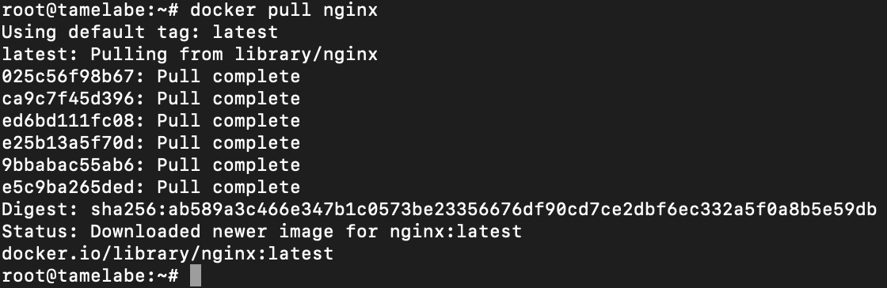
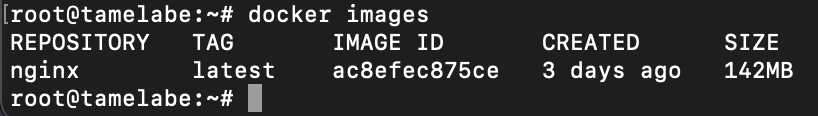
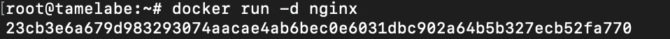
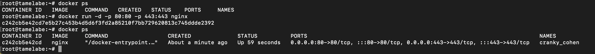
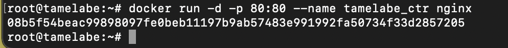
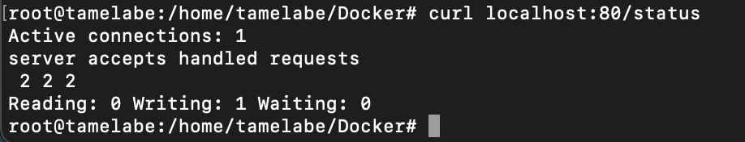
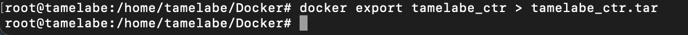
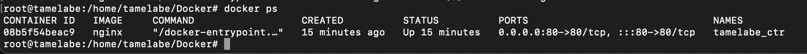
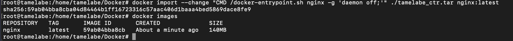
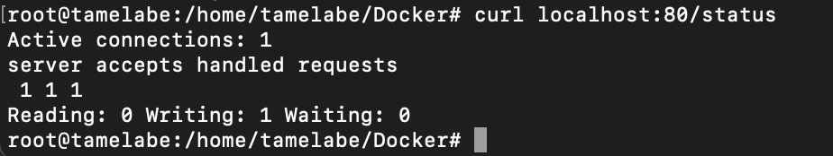

## Часть 1. Готовый докер

 Загрузка образа nginx через команду `docker pull`

Проверка наличия образа через команду `docker images`

Запуск образа через комнаду `docker run`

Проверка наличия процесса через команду `docker ps`

Просмотр информации о контейнере через команду \
`docker inspect [container_id]`

Размер докер образа

Его IP

Замапленый порт

Остановка докер образа и проверка его остановки

Запуск образа с замапленными портами

Проверка работы сервера

Остановка докер образа через команду `docker stop [container_id|container_name]` и проверка его остановки для выполнения 2 части задания

## Часть 2. Операции с контейнерами

Создание

Чтение конфигурационного файла nginx.conf внутри докер контейнера при помощи команды `exec`

Создание на локальной машине файла nginx.conf. Настройка в нем по пути /status отдачу страницы статуса сервера

    * 30 строка закомментирована чтобы nginx не цеплял другие конфиг файлы, препятствующие корректрой работе раздела `/status`

Копирование созданного конфиг файла в докер образ командой `docker cp` и перезапуск nginx внутри докер образа через `exec`

Проверка статуса сервера

Экспорт докер контейнера в архив через команду `export`

Остановка контейнера, проверка остановки

Удаление образа через `docker rmi [image_id|repository]` 

Удаление всех контейнеров

Импортировнаие контейнера через команду `import`

Запуск импортрованного контейнера

Проверка статуса сервера

## Часть 3. Мини веб-сервер

