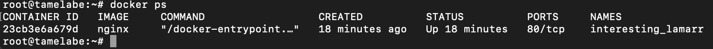
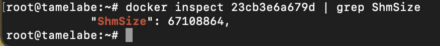
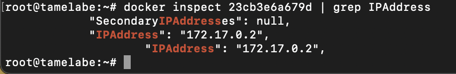
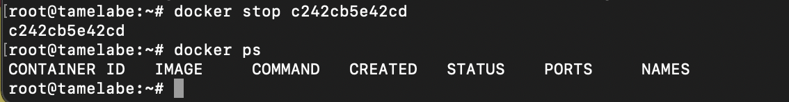

## Готовый докер

Загрузка образа nginx через команду `docker pull`

Проверка наличия образа через команду `docker images`

Запуск образа через комнаду `docker run`

Проверка наличия процесса через команду `docker ps`

Просмотр информации о контейнере через команду \
`docker inspect %container_id%`

Размер докер образа

Его IP

Замапленый порт

Остановка докер образа и проверка его остановки

Запуск образа с замапленными портами

Проверка работы сервера

Перезагрузка докер образа и проверка наличия процесса

